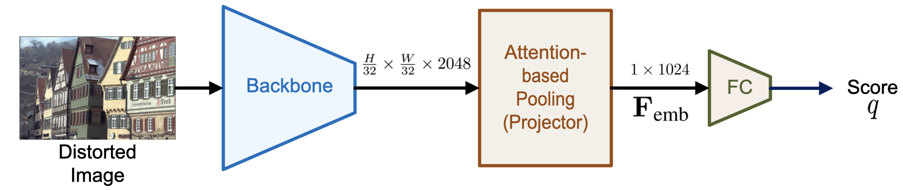

# HiRQA: Hierarchical Ranking and Quality Alignment for Opinion-Unaware Image Quality Assessment

This repository provides the official implementation of **HiRQA**, an opinion-unaware no-reference image quality assessment (NR-IQA) framework. HiRQA structures a hierarchical quality-aware embedding space using a novel pair-of-pairs ranking loss, embedding distance consistency loss, and contrastive alignment of image and text. It requires only a single distorted image during inference and generalizes effectively to real-world distortions. It also supports real-time quality prediction via its lightweight variant, **HiRQA-S**.

**Paper**:

> [**HiRQA: Hierarchical Ranking and Quality Alignment for Opinion-Unaware Image Quality Assessment**]()
> Vaishnav Ramesh, Haining Wang, Md Jahidul Islam

<p align="center">
  
</p>

---

## Installation

```bash
git clone https://github.com/uf-robopi/HiRQA.git
cd HiRQA
conda create -n hirqa python=3.10 -y
conda activate hirqa
conda install pytorch torchvision cudatoolkit=11.8 -c pytorch -c nvidia
pip install -r requirements.txt
```

---

## Pretrained Weights

We provide pretrained weights for:

* HiRQA (ResNet50))
* HiRQA-S (ResNet18)

You can download weights from [Dropbox](https://www.dropbox.com/scl/fo/noe9hjltjjq5xjm5mygjp/AJZ9ugEAf68z2aSAk9sfFvQ?rlkey=iaozkxvscihuvl9i71knghcly&st=knuxx4ot&dl=0).
Use the `--ckpt` argument during inference.

---

## Inference

To run HiRQA on benchmark datasets, first prepare the datasets as specified in their respective documentation. Then, provide the root directory as a parameter to the inference script.

```bash
python inference_iqa_dataset.py --dataset live  --dataset_path /path/to/dataset/root --model HiRQA --ckpt /path/to/HiRQA.pth
```

**Arguments**:

* `--dataset`: dataset name[live,csiq,tid2013,kadid10k,livec,koniq10k,flive,spaq]
* `--dataset_path`: Path to the root folder of benchmark dataset
* `--model`: Model backbone (`HiRQA` or `HiRQA-S`)
* `--ckpt`: Path to HiRQA or HiRQA-S `.pth` model

---

## Citation

```bibtex

```

---

## Acknowledgements

We thank the authors of [ARNIQA](https://github.com/miccunifi/ARNIQA) for their image degradation model and [CLIP]() for their text encoder used during training for alignment. We also thank the contributors of KADIS-700k and other benchmark IQA datasets used in this work.

---